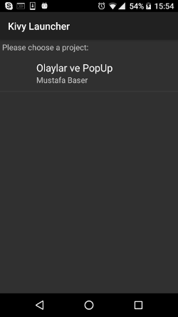
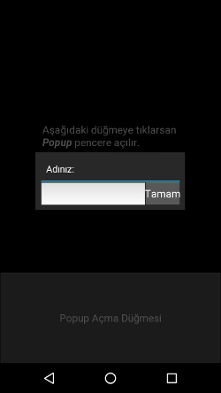

.. _kivyLauncher:

#####################################################
Andoid'de Çalıştırma: :index:`Kivy Launcher`
#####################################################

Kivy ile uygulamalar çoğunlukla mobil cihazlarda çalıştırmak için geliştirilir. Peki Windows yada Linux üzerinde
gelişrtirdiğimiz programları Android üzerinde nasıl çalıştıracağız? Bunun bilinen yolu `apk` paketi oluştrmaktır.
Yazdığınız programları `apk` paketi haline getirmeyi  Bölüm :ref:`paketleme` de anlatacağız.

Paketleme bölümünde anlatacağımız `apk` paketi yapmak olduçka zahmetli ve uzun bir işlemdir. Paketleme işini
en doğrusu programınız
belirli bir olgunluğa eriştikten sonra yapmaktır. Her yaptığınız değişiklikte programı derleyip paket haline
getirmek ve bunu android cihaza kurup çaluıştırmak, Python'un genel mantığına aykırıdır. Yorulmalamalı 
bir dil ile yazdığınız programları derleyip çalıştırmak :(
Bu bölümde programınızı
derlemenden, doğrudan kaynak kodu kullanarak çalıştırmanın yolunu anlatacağız.

Kivy Launcher Kurulumu
======================

Python/Kivy ile yazılmış programların derlenmeden doğrudan Android üzerinde çalışmasını sağlayacak bir
yorumluyuca ihtiyacımız olacak. Tıpkı Python yorumlayıcısı gibi. Android üzerinde kullanabileceğiniz
QPython işinizi görmeyecektir, çünkü QPython SL4A mekanızması ile çalışır. Kivy ve diğer eklentileri
kurmanız ve içermeniz mümkün değildir. `Kivy Launcher` bu amaçla hazırlanmış bir Python/Kivy
yorumalyıcısıdır. Üstelik birçok Python paketini de içermektedir. Örneğin 
`Pyjnius <http://pyjnius.readthedocs.io/en/latest/>`_ bile içerilmektedir.

`Kivy Launcher`'ı kurmak için Google Play'i açın ve arama kutusuna "Kivy Launcher". Bu bölümün yazıldığı
sırada çıkan sonuç :numref:`Şekil %s <kivylauncher1Img>` 'de görülmektedir.

.. _kivylauncher1Img:

   Kivy Launcher Kurulumu

"Yükle" düğmesine tıklayın ve kurulumu tamamlayın.

Kivy Launcher'a Uygulama Eklenmesi
==================================

Kivy Launcher birden fazla uygulamayı bailatablir. 
Bir programı çalıştırmak için SD karınızda ``kivy`` adlı
bir klasör oluşturmanız, uygulamanızı bu klasörün içerisinde bir klasöre kaydetmeniz gerekmektedir. Bu lkasöre
`uygulama klasörü` diyeceğiz. Uygulama klasöründe
``android.txt`` isimli dosyayı şu şekilde oluşturmalısınız:

::

    title=Uygulama Basligi
    author=Yazar Adi Soaydi
    orientation=portrait
    
`orientation` parametresi ``portrait`` (dikey) yada ``landscape`` (yatay) olabilir.

Şimdi :ref:`olaylarBolumu` Bölümünde yazdığımız programı (:numref:`olaylar_main6`) 
ve ilgili kv dosyasını (:numref:`olaylar_kv6` kullanarak) ``olayuyg.kv`` `Kivy Launcher`'da çalıştıralım.
Öncelikle SD karınızda oluşturduğunuz ``kivy``
isimli klasörde ``olayApp`` isimli bir klasör oluşturun. :numref:`olaylar_main6` programını
``main.py`` olarak ve ile :numref:`olaylar_kv6` dosyasını ``olayuyg.kv`` olarak bu klasöre
kopyalayın. Bu klasörde `android.txt` isimli dosyayı ben şu şekilde oluşturdum:

::

    title=Olaylar ve PopUp
    author=Mustafa Baser
    orientation=portrait

Yaptığımız işlem Windows'da 'deki gibi görünecektir.

.. _kivylauncher2Img:

.. figure:: ./resimler/kivylauncher/kivylauncher2Img.png

   Kivy Launcher'a Uygulama Eklenmesi

`Kivy Launcher` uygualama kalsöründeki ``main.py`` programını çalıştıracaktır. Bu nedenlen şimdiye kadar
tüm programlarımızı ``main.py`` olarak kaydettik. Benzer şekilde `apk` paketi yapacağınız uygualamanın
ana programı da `main.py` olacaktır.

Kivy Launcher'da Uygulamanın Başlatılması
=========================================

Android cihazınızda `Kivy Launcher` uygulamasını başlattığınızda:

.. _kivylauncher3Img:

   Kivy Launcher'da Uygulamalar

görünecektir. Uygulamıyı seçip başlatabilirsinz:

.. _kivylauncher4Img:

   Kivy Launcher'da Uygulamanın Çalışması

Eğer koduzunda bir hata oluşursa `CatLog` isimli uygulamaya `root` yetkisi vererek görebilirsiniz.
Benim terchim Linux'da ``adb logcat`` komutunu kullanmaktır.
