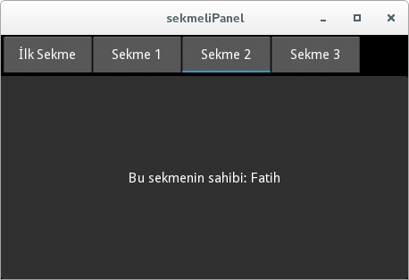
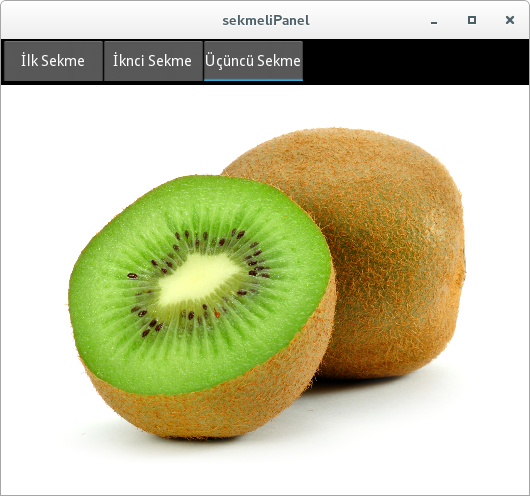

.. _sekmeler:

################################################
:index:`Sekmeli Panel` (:index:`TabbedPanel`)
################################################

Kivy'de sekmeler, diğer GUI'lerde olduğu gibi bir pencerede birden fazla sayfa görünümünü sunmak için kullanılır. Kivy'de `Sekmeli Panel`
(`TabbedPanel`) olarak isimlendirilir. Oluşturulduğunda size ön tanımlı olarak ``Default`` sekmesini sunacaktır.

Kod ile Sekmeli Panel Oluşturulması
====================================

Her zaman olduğu gibi, öncelikle kod ile nasıl sekmeli panel oluşturacağımızı göreceğiz. Sözü fazla uzatmadan hemen örnek kodumuzu verelim, programımızı 
:numref:`Liste %s <sekme1>`'deki gibi yazalım.

.. literalinclude:: ./programlar/sekmeler/1/main.py
    :linenos:
    :caption: main.py
    :name: sekme1
    :tab-width: 4
    :language: python

Şimdi burada olup biteni anlamaya çalışalım. Bir sekmeli panel ``TabbedPanel()`` parçacığı ile oluşturulur. Bir sekmeli panle oluşur oluşmaz ön tanımlı 
olarak :index:`default panel` ile oluştur ve bu ön tanımlı sekme sekme parçacığının özelliklerine :index:`default_tab` ın  ``text`` ve ``content`` 
özelliklerini kullarak yapabilirsiniz. Aslında bunu :index:`default_tab_text` ve :index:`default_tab_content` ile de yapmanız mümkün ancak ben öncekini
tercih ediyorum. Bunlardan ilki sekme başlığını ikincisi sekmenin içeriğini belirtir. Programımızda ön tanımlı sekmenin başlığını
``İlk Sekme`` içeriğini ise bir etiketten oluşturduk (etiket metinini açıklamaya gerek yok sanırım). Eğer ön tanımlı sekmeyi istemiyorsanız, 
sekmeli paneli oluştururken :index:`do_default_tab` parametresinin değerini ``False`` yapmalısınız. Diğer bir deyişye, ön tanımlı sekmesi olmayan bir
sekmeli paneli şu şekilde tanımlayabilirdik:

::

    sekmeli_panel = TabbedPanel(do_default_tab=False)
    
Sekmeli Panele yeni sekmeler eklemek için, öncelikle bu sekmeyi hazırlamanız gerekir. Bunu sekme parçacığı :index:`TabbedPanelHeader()` kullanarak
yaparız. Bu parçacığın ``text`` özelliği sekmenin başlığını gösterir. İçeriğini ise, :index:`content` özelliği ile oluşturabilirsiniz. ``content``
özelliğine istediğiniz bir pencere düzeni atayabilirsiniz. Burada basit olsun diye sadece bir etiket atadık. 

Programımız önce ön tanımlı sekme oluşturuyor. Daha sonra bir sekme başlıkları "Sekme <sayi>" ve sekme içeriklerindeki etiketlerin metinleri
"Bu sekmenin sahibi: <isim>" olacak şekilde yeni sekme parçacıkları oluşturup bunları Sekmeli Panele ekliyor. Programımız çalıştığında 
:numref:`Şekil %s <sekmeler-sekme1Img>`'deki gibi olacaktır.

.. _sekmeler-sekme1Img:

   Dört sekmeli panel
   
Şimdi biraz olaylara bakalım. İlk olarak ön tanımlı sekmeye geçiş yapıldığında oluşan olayı bir işeleve bağlayalım:

::

    sekmeli_panel.default_tab.bind(on_release = self.sekmeDegistirildi)
    
    
Bu satırı ``return`` den hemen önce yazabilirsiniz. ``sekmeDegistirildi()`` işlevini de şu şekilde yazalım:

::

    def sekmeDegistirildi(self,sekme):
        popup = Popup(title='Sekme Değiştirildi',
                      content=Label(text= "Sekme Başlığı: "+sekme.text),
                      size_hint=(None, None), size=(200, 200))
        popup.open()
    

Bu işlevi yazdıktan sonra programınızın başına aşağıdaki saırı yazarak ``Popup`` perçacaığını içermelisiniz:

::

    from kivy.uix.popup import Popup
   
   
Şimdi programınızı çalışrırın ve bir sekmeye geçtikten sonra tekrar ön tanımlı sekmeye geçiş yapın. Popup penceres açılacaktır. İsterseniz tüm sekmelere
geçiş yaptığınızda bu popup penceresini görüntülemek için ``for`` döngü bloğunu btirmeden önce aşağıdaki satırı ekleyebilirsiniz:

::

    sekme.bind(on_release = self.sekmeDegistirildi) 
   
kv Dili ile Sekmeli Panel Oluşturulması
========================================

Şimdi kv dili ile nasıl sekme oluşturabileceğimize bakalım. Sekmeli panleimizde hiçbir işlev yapmadan sadece oluşturalım. İlk olarak programımızı 
:numref:`Liste %s <sekme2>`'deki gibi yazalım.

.. literalinclude:: ./programlar/sekmeler/2/main.py
    :linenos:
    :caption: main.py
    :name: sekme2
    :tab-width: 4
    :language: python

kv dosyasını da :numref:`Liste %s <sekme_kv2>`'deki gibi yazalım.

.. literalinclude:: ./programlar/sekmeler/2/sekmelipanel.kv
    :linenos:
    :caption: sekmelipanel.kv
    :name: sekme_kv2
    :tab-width: 4

Burada gördüğünüz gibi ikinci sekemede bir etiket ve bir işlevsiz düğme bulunmaktadır. Son sekemde ise sadece bir resim bulunuyour.
``main.py`` programını çalıştıracak olursak, :numref:`Şekil %s <sekmeler-sekme2Img>`'deki gibi olacaktır.

.. _sekmeler-sekme2Img:

   Dört sekmeli panel

